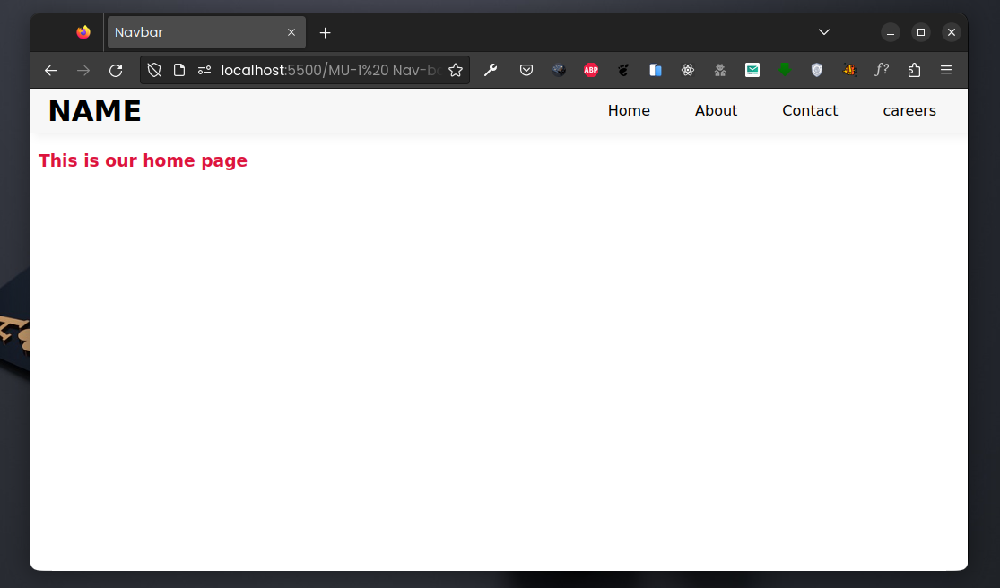
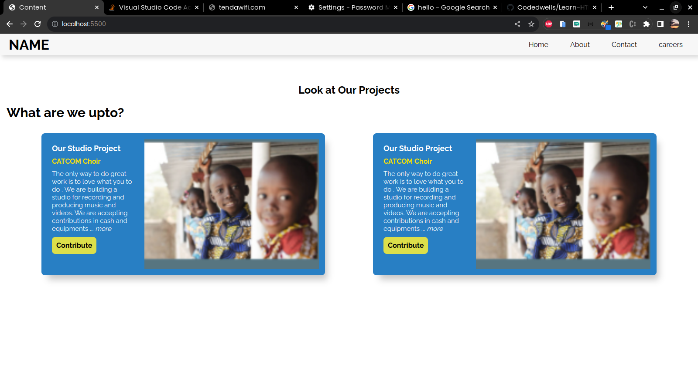
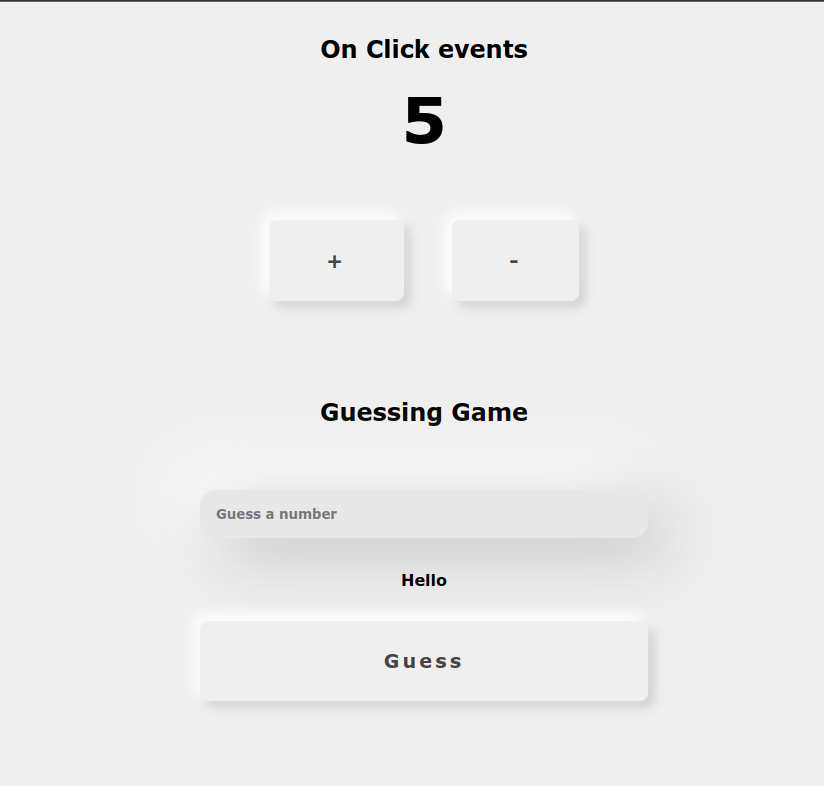

# This repo contains source code for our local communitiy's Web-track
## Meet-Up 1 Nav-Bar
**Friday Feb 3rd 2023** \
During this session we introduced some basic HTML and CSS concepts to out newer members.  
We built a simple **nav-bar** as a of demonstrating the basic use of HTML and CSS.  

<hr>

### The source code is [here](./1_NavBar/)



## Meet-Up 2 Cards
**Tuesday Feb 8rd 2023** \
During this session we were able to  make cards to futher cement the concepts of flexbox.\
We also made the cards responsive using some media queries.

### The source code is [here](./2_modal_cards/)


<hr>

## Meet-UP 3 Intro to JavaScript
**Friday Feb 10th 2023**\
During this session we introduced the basics of JavaScript. Some base concepts were\
covered. Some concepts covered include;
* Naming convension i.e camelCase
* Variables declaration using diffrent key words.
    ```js
    // Varibles
    var myName = 'John';
    let location = 'Nairobi';
    const career = 'Web development';
    ```
* Functions
  ```js
    function sayHello() {
	    console.log('Hello world!!!');
    }

    sayHello(); // Hello world!!!

    // ES6 Arrow functions
    const sayHi = () => {
	    console.log('Hi World!!!');
    };

    sayHi(); // Hi World!!!
  ```

* Conditional statements
  ```js
    // If statement
    if (1 < 2) {
	    console.log('Less than two!!');
    }

    // if else statement
    if (6 > 2) {
	    console.log('Greater than two!!!');
    } else {
	    console.log('Less than two!!!');
    }

    // else if statements
    if (4 > 9) {
	    console.log('less than nine');
    } else if (4 < 9) {
	    console.log('Less than nine');
    } else {
	    console.log('Does not meet the  condition');
    }
  ```

* Looooops
  ```js
    // for loop
    for (let i = 0; i < 10; i++) {
	    console.log(i);
    }

    // While loop
    let j = 1;
    while (j < 10) {
	    console.log(j);
	    j++;
    }
  ```

We wrapped the day up by creating a  function to find the sum of\
all even numbers between 1 and 10;

```js
function addEvenNumbersBetween1and10() {
	let number = 1;
	let sum = 0;

	while (number < 11) {
		if (number % 2 == 0) {
			sum += number;
		}
		number++;
	}
	console.log(sum); // 30
}

addEvenNumbersBetween1and10();
```

### The source code is [here](./3_Intro_js/)


<hr>


## Meet-UP 3 Intro to JavaScript
**Friday Feb 17th 2023**\
During this session we were introduced to the DOM.** Document Object Model**.\
We explored basic **DOM manipulation**  and DOM events.

### The source code is [here](./4_DOM/)

<hr>

## Meet-UP 4 JavaScript
**Friday Feb 17th 2023**\
During this session we had a recap of the what some basic JavaScript concepts.** Document Object Model**.\
We also explored more **DOM manipulation**  and DOM events.

### FizzBuzz
We started the recap by making the common fizzBuzz algorithm.

```js
  const fizzBuzz = () => {
	for (let i = 1; i <= 20; i++) {
		if (i % 2 === 0) {
			console.log(i, 'Fizz');
		} else {
			console.log(i, 'Buzz');
		}
	}
};
fizzBuzz();
```

<hr>

## Meet-UP 5 JavaScript DOM events
**Friday Feb 17th 2023**\
During this session we had learnt Click events.We created a counter app\
and a number guessing game.

### The source code is [here](./5_DOM_Events/)



<hr>

&nbsp;
&nbsp;

<hr>

<div style="display:flex;flex-direction:column;align-items:center;">
    <h3>Our leads</h3>
    <p>Abel Misiocha <a href="https://github.com/Codedwells">GitHub</a></p>
    <p>Cliff Omollo <a href="https://github.com/OsegoTech">GitHub</a></p>
</div>

